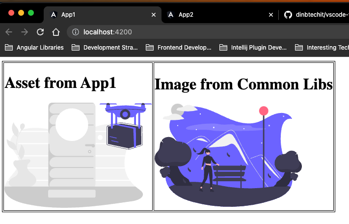
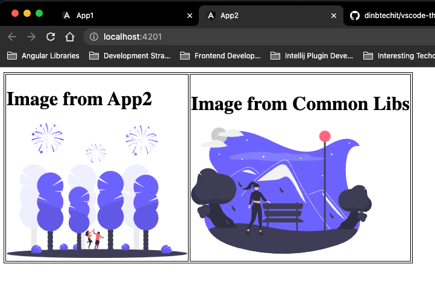
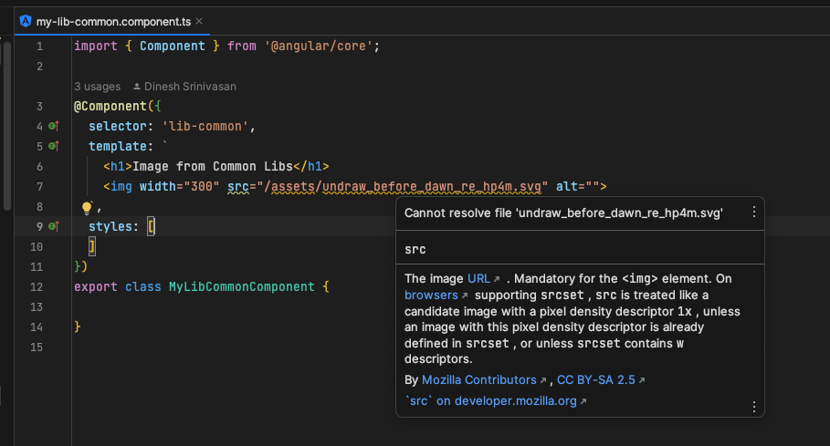
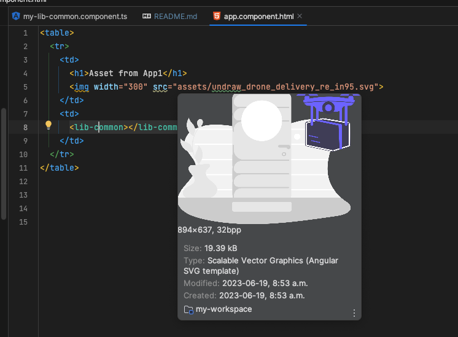
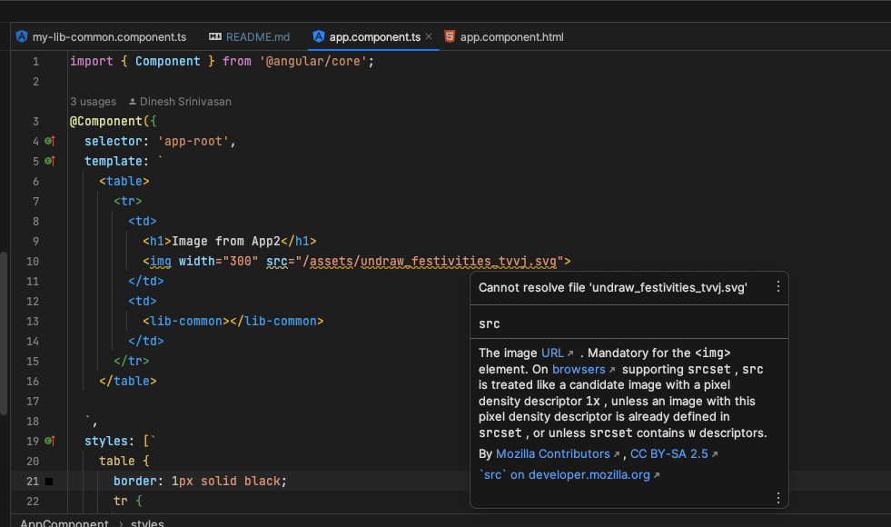

# MyWorkspace

A monorepo created to demonstrate intellij IDE unable to resolve `src/assets` images within inlineTemplates.  

## To Run the app
```shell
npm run start:all
```

That should bring 2 apps

### App1: 
http://localhost:4200




### App2:
http://localhost:4201



## Issue:
1. [Not working] In `libs/common`, unable to resolve assets directory within Inline Templates:


2. [Works] In `projects/app1` is able to resolve images:


3. [Not working]  In `projects/app2` unable to resolve assets directory within Inline Templates:


